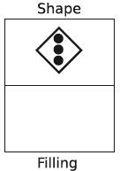

# Are women better than men at multitasking?
This is the question Stoet, O’Connor, Conner, and Laws aimed to address in their [study](https://bmcpsychology.biomedcentral.com/articles/10.1186/2050-7283-1-18). In this project, I will replicate its experimental design. It consists of two experiments.

**Table of Contents**

- [Rationale](#Rationale)
- [My implementation with Python](#my-implementation-with-python)
- [Creating stimuli](#creating-stimuli)
- [Experiment 1](#experiment-1)
- [Data abalysis & visualization](#data-analysis-&-visualization)

## Rationale
The subjects are asked to report either the shape of the frame of the stimulus or the number of circles inside of it based on the location in which the stimulus appeared. This paradigm is useful for the assessment of the so-called *switching cost*: the increase in response times due to a change in instructions. Figure 1 depicts an example trial.

*Figure 1. An example of the "shape" task, where the subject has to decide whether the imperative stimulus has the shape of a square of that of a diamond. The right response is "diamond"*

If the imperative stimulus appears at the top part of the screen labeled "Shape", the subject is supposed to report as quickly as possible the shape of the surrounding frame (either a square or diamond). If the stimulus appears in the bottom part of the screen labeled "Filling", the subject is supposed to report the number of circles inside the frame (either 2 or 3). All possible trials are illustrated in figure 2.

*Figure 2. Every trial and corresponding correct responses.*

## My implementation with Python

### Creating stimuli

### Experiment 1

### Data abalysis & visualization

