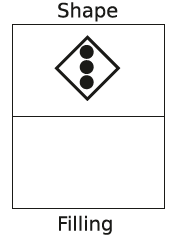
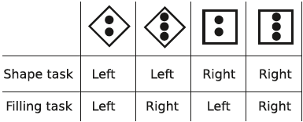
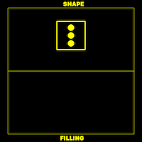
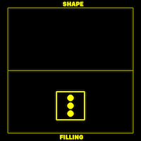
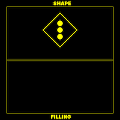

# Are women better than men at multitasking?
This is the question Stoet, O’Connor, Conner, and Laws aimed to address in their [study](https://bmcpsychology.biomedcentral.com/articles/10.1186/2050-7283-1-18). In this project, I will replicate its experimental design. It consists of two experiments.
 
- Project page: <https://victoris93.github.io/PCBS_Women_vs_Men_Multitasking/>
**Table of Contents**

- [Rationale](#Rationale)
- [My implementation with Python](#my-implementation-with-python)
	- [Creating stimuli](#creating-stimuli)
	- [Experiment 1](#experiment-1)
	- [Data analysis & visualization](#data-analysis-&-visualization)

## Rationale
The subjects are asked to report either the shape of the frame of the stimulus or the number of circles inside of it based on the location in which the stimulus appeared. This paradigm is useful for the assessment of the so-called *switching cost*: the increase in response times due to a change in instructions. Figure 1 depicts an example trial.

*Figure 1. An example of the "shape" task, where the subject has to decide whether the imperative stimulus has the shape of a square of that of a diamond. The right response is "diamond"*

## My implementation with Python
If the imperative stimulus appears at the top part of the screen labeled "Shape", the subject is supposed to report as quickly as possible the shape of the surrounding frame (either a square or diamond). If the stimulus appears in the bottom part of the screen labeled "Filling", the subject is supposed to report the number of circles inside the frame (either 2 or 3). All possible trials are illustrated in figure 2.

*Figure 2. Every trial and corresponding correct responses.*

Half of the stimuli were cogruent, the other half - incongruent. The former category comprises those tasks for which correct keys are identical and which have the same geometrical features. For example, a "shape" task stimulus involving a square and 3 dots inside requires the same response key as the "filling"task stimulus which the same configuration. Incongruent trials are those involving stimuli of different tasks and different geometrical configurations. Consequently, the corresct response keys for these tasks are not the same. Examples of a congruent and incongruent trials are provided in figures 3 and 4.
 

*Figure 3. An example of two congruent trials of different tasks. They both require the same response key.*
This project consists of three separate scripts generating stimuli, executing the experiment and the one analysing the data. 

### Creating stimuli

The script `generate_stimuli.py` generates and saves eight images with filenames corresponding to the task, shape and the filling of the stimulus. These filanames are further exploited to attribute factors to the stimuli. Figure 3 illustrated one of the eight stimuli.

*Figure 4. The filling task: one of the eight stimuli named "filling_diamond_3_circles.png". The subject is instructed to report the number of circles within the frame and ignore its shape.*

### Experiment 1
The experimental procedure follows the one outlined in Stoet, O’Connor, Conner, & Laws (2013).  `experiment_1.py` launches the expermient. 
First, the subject undergoes a training session whereby the data are not yet collected. The program starts with the presentation of instructions and asks the participant to proceed by pressing the space bar. The training consists in 40 trials each involving the presentation of a stimulus randomly picked from the eight stimuli generated earlier. Each time the participant presses the wrong key, an error message appears along with a reminder of the instructions. The message remains on the screen for 5 seconds followed by a 800ms pause after which the training is resumed.
At the end of the training, the participant is presented with a message of completion and the reminder of instructions. Next, the participant is asked to report their sex after which the experimental trials begin.

The main experiment consists of 192 trials and 3 blocks, so each block contains 64 trials. The first two blocks are the so-called "pure" blocks: the participant first performs only the "shape" task and then only the "filling" task. The last block is a "mixed" block. Within this block, the tasks are classified either "mixed repeat" or "mixed switch". The attribution of factors "pure" , "mixed repeat" and "mixed switch" to trials is carried out at the stage of data manipulation and is therefore not present in the code of the experiment.
### Data analysis & visualization

